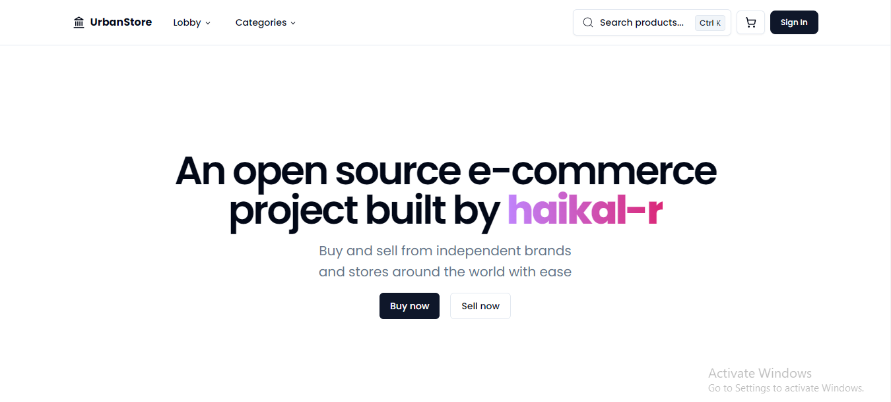

# [Urbanstore](https://urbanstore.vercel.app/)

An open source e-commerce project built by [haikal-r](https://github.com/haikal-r)

## Tech Stack 💻

- **Client Framework:** [React.js](https://react.dev)
- **Server Framework:** [Express.js](https://expressjs.com)
- **Styling:** [Tailwind CSS](https://tailwindcss.com)
- **Authentication:** [OAuth 2.0](https://oauth.net/2/) &  JSON Web Tokens (JWT)
- **Database:** [PostgreSQL](https://postgresql.org)
- **ORM:** [Prisma ORM](https://www.prisma.io)
- **UI Components:** [shadcn/ui](https://ui.shadcn.com)
- **Image Uploads:** [IMGBB](https://imgbb.com/)
- **Payments infrastructure:** [Midtrans](https://midtrans.com)

## Where do I deploy this?

- For the ReactJS application, I deploy it on [Vercel](https://vercel.com/)
- And for the PostgreSQL database I deploy it on [Supabase](https://supabase.com/)

s